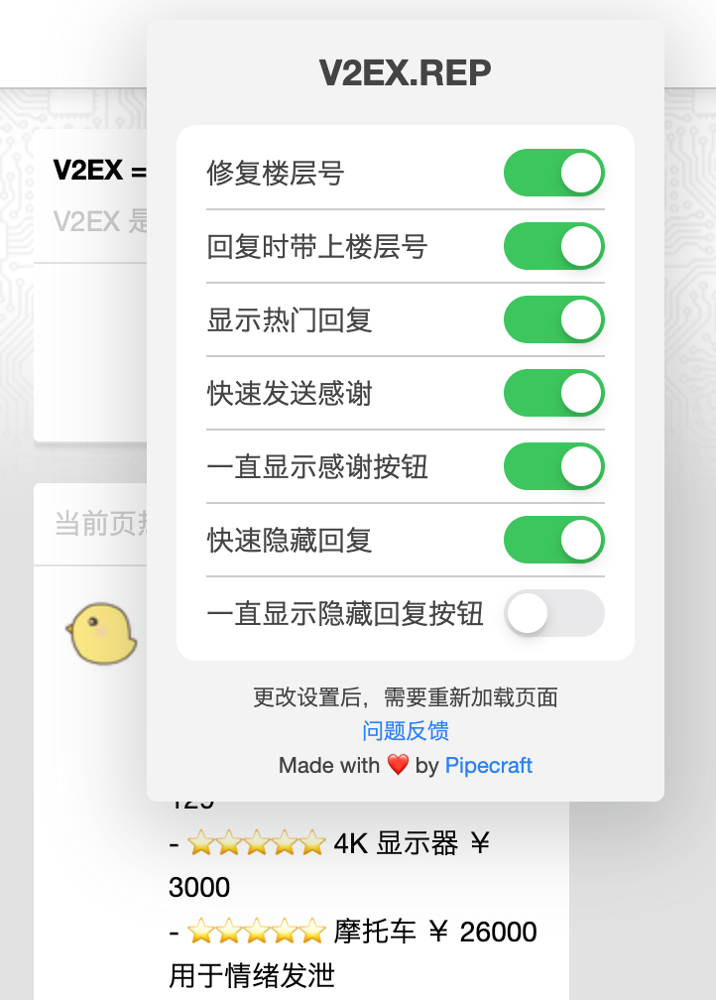
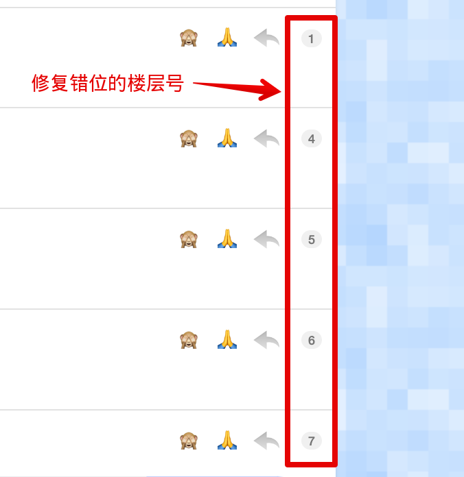
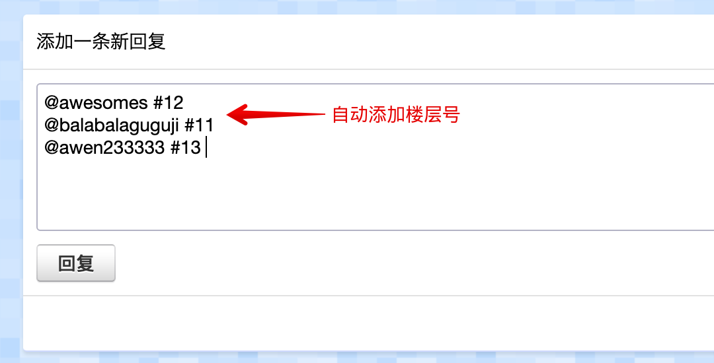
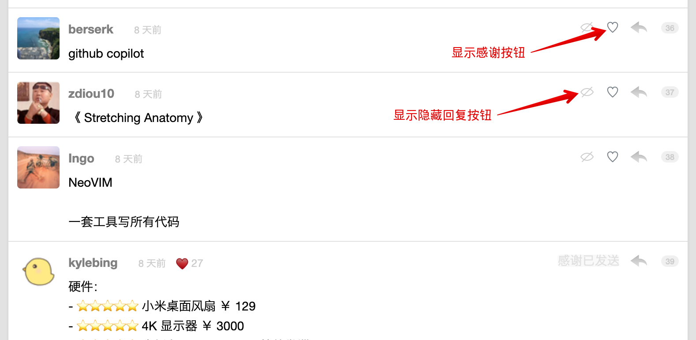

# V2EX.REP - 专注提升 V2EX 主题回复浏览体验

专注提升 V2EX 主题回复浏览体验的浏览器扩展/用户脚本。

## 主要功能

- ✅ 修复有被 block 的用户时错位的楼层号
- ✅ 回复时自动带上楼层号
- ✅ 一直显示感谢按钮 🙏
- ✅ 一直显示隐藏回复按钮 🙈
- ✅ 快速发送感谢/快速隐藏回复（no confirm）

## 页面截屏

- 设置功能，每个功能可单独开或关



- 修复有被 block 的用户时错位的楼层号，控制台可看到被屏蔽的楼层与内容




- 回复时自动带上楼层号



- 一直显示感谢按钮/回复按钮



## Installation

- Chrome Extension: [Manual Installation](manual-installation.md)
- Edge Extension: [Manual Installation](manual-installation.md)
- Firefox Addon: [Manual Installation](manual-installation.md)
- Userscript: [https://greasyfork.org/scripts/466589-v2ex-rep](https://greasyfork.org/scripts/466589-v2ex-rep)

## Development

This extension/userscript is built from [Browser Extension Starter and Userscript Starter](https://github.com/utags/browser-extension-starter)

## Features

- One codebase for Chrome extesions, Firefox addons, Userscripts, Bookmarklets and simple JavaScript modules
- Live-reload and React HMR
- [Plasmo](https://www.plasmo.com/) - The Browser Extension Framework
- [esbuild](https://esbuild.github.io/) - Bundler
- React
- TypeScript
- [Prettier](https://github.com/prettier/prettier) - Code Formatter
- [XO](https://github.com/xojs/xo) - JavaScript/TypeScript linter

## Showcases

- [🏷️ UTags - Add usertags to links](https://github.com/utags/utags) - Allow users to add custom tags to links.
- [🔗 Links Helper](https://github.com/utags/links-helper) - Open external links in a new tab, open internal links matching the specified rules in a new tab, convert text to hyperlinks, convert image links to image tags, parse Markdown style links and image tags, parse BBCode style links and image tags

## How To Make A New Extension

1. Fork [this starter repo](https://github.com/utags/browser-extension-starter), and rename repo to your extension name

2. Clone your repo

3. Install dependencies

```bash
pnpm install
# or
npm install
```

## Getting Started

First, run the development server:

```bash
pnpm dev
# or
npm run dev
```

Open your browser and load the appropriate development build. For example, if you are developing for the chrome browser, using manifest v3, use: `build/chrome-mv3-dev`.

You can start editing the popup by modifying `popup.tsx`. It should auto-update as you make changes. To add an options page, simply add a `options.tsx` file to the root of the project, with a react component default exported. Likewise to add a content page, add a `content.ts` file to the root of the project, importing some module and do some logic, then reload the extension on your browser.

For further guidance, [visit our Documentation](https://docs.plasmo.com/)

## Making production build

Run the following:

```bash
pnpm build
# or
npm run build
```

This should create a production bundle for your extension, ready to be zipped and published to the stores.

## Submit to the webstores

The easiest way to deploy your Plasmo extension is to use the built-in [bpp](https://bpp.browser.market) GitHub action. Prior to using this action however, make sure to build your extension and upload the first version to the store to establish the basic credentials. Then, simply follow [this setup instruction](https://docs.plasmo.com/framework/workflows/submit) and you should be on your way for automated submission!

## License

Copyright (c) 2023 [Pipecraft](https://www.pipecraft.net). Licensed under the [MIT License](LICENSE).

## >\_

[](https://www.pipecraft.net)
[](https://utags.pipecraft.net)
[](https://dto.pipecraft.net)
[](https://www.bestxtools.com)
